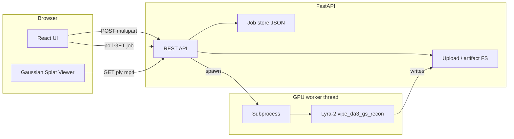

# Architecture — Lyra Walkthrough Host



## Components

### Backend (`walkthrough-host/backend`)

- **FastAPI** application with CORS for the dev frontend.
- **Job model**: `id`, `status` (`pending` | `processing` | `completed` | `failed`), `created_at`, `updated_at`, `message`, `error`, paths to input video and output directory.
- **Storage layout** (configurable `DATA_DIR`):

  ```
  DATA_DIR/
    jobs/{uuid}/
      meta.json
      input.{ext}
      output/
        reconstructed_scene.ply
        gs_trajectory.mp4
        .done
  ```

- **Worker**: On job start, a background thread runs a shell command equivalent to:

  ```bash
  cd "$LYRA2_ROOT"
  export PYTHONPATH=.
  python -m lyra_2._src.inference.vipe_da3_gs_recon \
    --input_video_path "$INPUT" \
    --output_dir "$OUTPUT" \
    [--max_frames ...] [--da3_max_frames ...]
  ```

  Environment variables pass optional CLI flags.

### Frontend (`walkthrough-host/frontend`)

- **Vite + React + TypeScript**.
- Upload page with progress and job status polling.
- **Viewer page**: uses `@mkkellogg/gaussian-splats-3d` to load the PLY from `/api/jobs/{id}/reconstructed_scene.ply` (path must end in `.ply` for format sniffing); `/api/jobs/{id}/ply` remains an alias.

### Docker (`walkthrough-host/docker`)

- **Dockerfile** based on an NVIDIA CUDA + PyTorch image; document that operators still run Lyra’s full install inside the image build or mount a prebuilt conda env.
- **docker-compose.yml**: service `walkthrough` with `deploy.resources.reservations.devices` for GPU; volume mounts for `Lyra-2`, checkpoints, and `DATA_DIR`.

Parallel agents should follow [MULTI_AGENT.md](./MULTI_AGENT.md) so lanes (Lyra core vs host app) do not conflict.

## Security notes (self-hosted)

- No auth in v1; deploy behind VPN or reverse proxy with authentication if exposed.
- File size limits and allowed MIME types enforced on upload.
- Job IDs are UUIDs; consider rate limiting in production.

## Configuration reference

| Variable | Purpose |
|----------|---------|
| `LYRA2_ROOT` | Absolute path to `Lyra-2` directory in this repo |
| `DATA_DIR` | Job and upload storage |
| `DA3_MODEL_PATH` | Optional override for `--da3_model_path_custom` |
| `MAX_FRAMES` | Cap frames read from upload (0 = unlimited) |
| `DA3_MAX_FRAMES` | Uniform subsample cap for DA3 |
| `CORS_ORIGINS` | Comma-separated origins for FastAPI |
